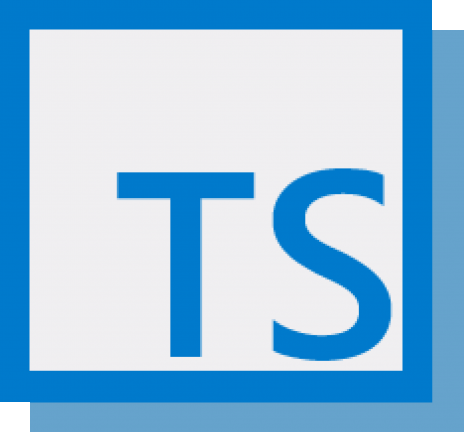
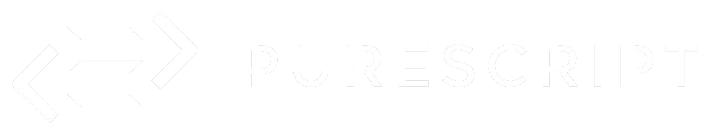

# Compiling

# to JS

~

~ why


----

> Hello! My name is Arne Martin and I work as a web developer at a very small design agency
> called Kvitebjørn Designbyrå in Trondheim here in Norway. Kvitebjørn is an old Norwegian
> word for polar bear. We mostly design and develop web sites and simple web applications.
> I am the sole developer and I do everything from managing servers to writing CSS, but most
> of my time is spent with frontend development, i.e stuff that would be relevant for you,
> the audience. This talk, however, will probably be anything but relevant for most of
> y'all's day-to-day work.

~

# Hello

~

~ *Arne Martin Aurlien*

~ *am@aurlien.net* / *@arnemart*

~

~ Kvitebjørn Designbyrå / kvitebjorn.com

--

~

~ (•ᴥ•)


----

> There are many programming languages in the world, but in the browser there's really only
> one, and outside (and indeed sometimes inside) the world of web/frontend developers --
> people like us -- javascript is not always what you would call "beloved". I really like
> writing JS, it has its charms, but it certainly also has a few quirks, and fair share of

~

~ So what was this talk about again

# Compiling

# to JS

----


~ wat

> wats


----

> but it's not the only alternative. There are several languages that use JS as
> a compilation target, allowing you to write code for the browser in whatever manner
> you prefer.

~

~ So what was this talk about again

# Compiling

# to JS

----

> There's typescript from Microsoft, if you like writing JS but want some additional type safety

~



```javascript
interface Shape {
  name: string;
  width: number;
  height: number;
  color?: string;
}

function area(shape : Shape) {
  var area = shape.width * shape.height;
  return "I'm " + shape.name + " with area " + area + " cm squared";
}
```

----

> There's coffeescript, if you like whitespace and hate everything that's good and natural

~


```coffeescript
upperCaseExpr = (textParts, expressions...) ->
  textParts.reduce (text, textPart, i) ->
    text + expressions[i - 1].toUpperCase() + textPart

greet = (name, adjective) ->
  upperCaseExpr"""
               Hi #{name}. You look #{adjective}!
               """
```

----

> There's clojurescript, if you love wearing out your 8 and 9 keys

~


```clojure
(defn set-html! [el content]
 (set! (.-innerHTML el) content))

(defn main []
 (let [content "Hello World from ClojureScript"
  element (aget (js/document.getElementsByTagName "main") 0)]
  (set-html! element content)))
```

----

> If you like Haskell, there's Elm, a fun and friendly
> language despite its haskell roots

~


```haskell
module Hello exposing (..)

import Html exposing (text)

main =
  text "Hello"
```

----


> And if you LOVE Haskell, there's PureScript
> Also there are several others.

~



```haskell
render :: T.Render _ {} _ {}
render _ _ _ _ = R.div' [ R.h1' [ R.text "Hello world!" ] ]

spec :: T.Spec _ {} _ {}
spec = T.simpleSpec {} perfAction render

perfAction :: T.PerformAction _ {} _ {}
perfAction _ _ = T.modifyState (const {})

main :: ∀ eff. Eff (dom :: DOM.DOM | eff) R.ReactElement
main = body >>= R.render (R.createFactory (T.createClass spec) {})
    where
        body = do
            win <- DOM.window
            doc <- DOM.document win
            elm <- fromJust <$> toMaybe <$> DOM.body doc
            return $ DOM.htmlElementToElement elm
```

----

> But how do all of these languages work?

~

~

~

~

~ how do they work

----

> There's some code in a not-JS-language, something happens, and then there's some JS-code


~ how do they work

----

> Let's talk about compilers. For the most part, this next bit applies to most compilers
>  -- the "to JS"-part is almost incidental. This is how compilers work.

~

~

# Compiling

# to JS

----

~

~

# Compiling

--

# (the JS is incidental)

----

> But before we start diving into that: Let be be the first to admit that I DON'T KNOW THIS STUFF
> I have never written or worked on a "real" compiler, and even though I have a degree in computer
> science I never took the compiler class -- i find this stuff fun and interesting but I have
> literally no idea what I'm doing.

~

~

~

~

~

~ **warning**

~

--


~ *I have no idea what I'm doing*

----

> Okay, that's out of the way. What does a compiler do? Compiling usually happens in several steps,
> what steps there are and how they work varies from compiler to compiler, but here is a general
> overview of a common setup. I will go a bit deeper into each of these steps in a moment.
> Lexical analysis: Turns source code into a stream of tokens
> Syntactical analysis: Turns tokens into an abstract syntax tree
> AST transformation: Turns an AST into another AST
> Code generation: Generates target code

# What's a compiler do

~

--
- Lexical analysis (using a *tokenizer* or *lexer*)
--
- Syntactical analysis (into an *A*bstract *S*yntax *T*ree)
--
- AST Transformation
--
- Code generation


----

> So what are tokens? During the first step, lexical analysis, the lexer or tokenizer reads the
> source code and generates tokens. This is a simple list of every part of the program,
> basically a stricter representation of the source code of the program. The tokens then go into
> syntactical analasys to produce the AST.

# Tokens

--

~ A structured representation of the text of the program

--

```javascript
console.log(greeting + " web rebels");
```

--

```javascript
[
  { type: "identifier", value: "console" },
  { type: "dot", value: "." },
  { type: "identifier", value: "log" },
  { type: "paren", value: "(" },
  { type: "identifier", value: "greeting" },
  { type: "operator", value: "+" },
  { type: "string", value: " web rebels" },
  { type: "paren", value: ")" },
  { type: "semicolon", value: ";" }
]
```

----

> The AST is a hierarchical data structure that represents every part of the program. The list of
> tokens is parsed and turned into a recursive data structure that is syntactically valid. If
> there are syntax errors in the code, like unbalanced parens and stuff, this is usually where
> they are discovered.
> The AST contains all relevant info about a program, this example is simplified -- usually
> stuff like where something appears in the source code is included, for better error messages,
> also other stuff.

# AST

--

~ A data structure representing the entire program

--

```javascript
console.log(greeting + " web rebels");
```

--

```javascript
{
  type: "Program",
  body: [
    {
      type: "CallExpression",
      callee: {
        type: "MemberExpression",
        object: {
          type: "Identifier",
          name: "console"
        },
        property: {
          type: "Identifier",
          name: "log"
        }
      },
      arguments: [
        {
          type: "BinaryExpression",
          operator: "+",
          arguments: [
            { type: "Variable", name: "greeting" },
            { type: "StringLiteral", value: " web rebels" }
          ]
        }
      ]
    }
  ]
}
```

----

> The next step is AST transformation. When compiling to JS, this usually means converting the
> AST for the language you are compiling into an AST that is JS-compatible.
> This can be done by "walking the tree" using a recursive function that starts at the root node and visits
> each node in the tree depth-first, and creates a new tree based on what it encounters.

# Transformation

~ AST ==> another AST

~

--


----

> Finally the transformed AST is walked to generate the final code of the compiled program. For us,
> that's JS code, for "serious" or "real" compilers it would be some sort of bytecode or machine code.
> In this example, let's say you want to compile JS to some sort of lisp for some reason.

# Code generation

~ Transformed AST ==> target code

--

```javascript
console.log(greeting + " web rebels");
```

--

              ||
              \/

--

```clojure
((:log console) (+ greeting, " web rebels"))
```

----


> Just a brief aside into a topic that is actually very important and relevant: Such things as parser
> generators exist. This is basically a compiler compiler, where you define the grammar of your
> language by specifying how tokens look and how they are allowed to fit together, and have the parser,
> generator generate the parser for you. For javascript there is Jison, which is based off of Gnu Bison,
> and generates a parser based on a context-free BNF grammar. I won't be using a parser generator for
> the demo code as I want to show you the basics.

~

# Parser generators

~

~ and grammars and stuff

--

~

- *Jison*
--
- Is a thing that exists in the world


----

> Okay, over to the practical part. Let's write a compiler!

~

# The practical part

~

--

~ quote unquote

----

> I have created a programming language. It is exceedingly simple and can only be used for one thing:
> Rolling dice. Anyone ever play dungeons and dragons? I haven't but I know that dice are used for this
> game. This programming language rolls dice, in a syntax that should maybe probably be familiar for
> D&D-players.
> 1d6 means roll one 6-sided die, 2d8 + 5 means roll two 8-sided dice and add 5 to the result.
> The JS code we want to generate for this looks similar to this: Basically a bunch of math.randoms.

~

# The Dice Roller Language

--

~

~ Ever play D&D?

--

~ *1d6* = roll one six-sided die

--

~

            1d6 + 2   =>   3,4,5,6,7,8
            2d8 + 5   =>   7...21

--

            1d6 + 2   =>   Math.floor(Math.random() * 6) + 1 + 2
            2d8 + 5   =>   Math.floor(Math.random() * 8) + 1 + Math.floor(Math.random() * 8) + 1 + 2


----

> We will implement a tokenizer for lexical analysis, a parser for syntactical analysis, and
> a code generator to generate the final JS code. The tokens should look like this:

~

# The Dice Roller Language

~

Tokens:

    2d6 + 3

```javascript
[
  { type: "dice",     value: "2d6" },
  { type: "operator", value: "+" },
  { type: "number",   value: "3" }
]
```

----

> And the AST should look like this:

~

# The Dice Roller Language

~

AST:

    2d6 + 3

```javascript
{
  type: "program",
  body: {
    type: "operatorExpression",
    operator: "+",
    lhs: {
      type: "diceExpression",
      lhs: { type: "number", value: "2" },
      rhs: { type: "number", value: "6" }
    },
    rhs: { type: "number", value: "3" }
  }
}
```


----

> That's the basic idea. Now let's make it.

~

~

~ _demo time_


----

> That just about what everything I have to say to you today. I hope this whet your apetite
> for stuff like this, it can be really fun once you get into it.
> If any of you want to talk about emacs later, find me and we'll have a beer.

~

# Wow what a ride

~

~ **the end**

~

~ *github.com/arnemart/webreb2k17* / *twitter.com/arnemart*
